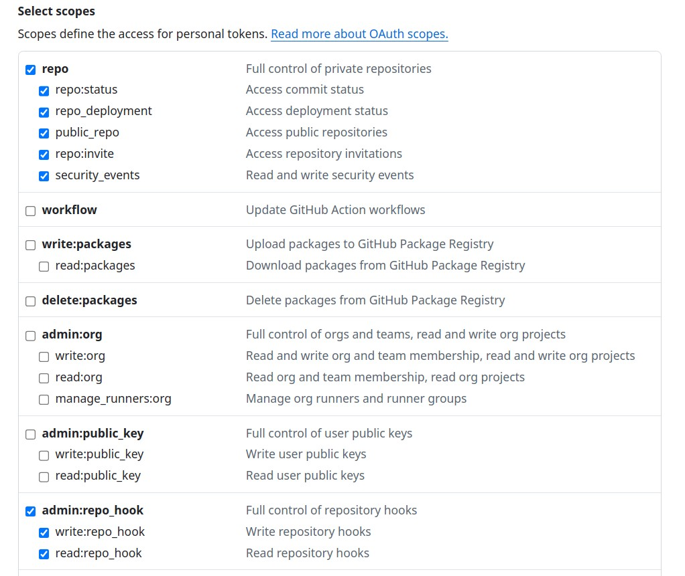
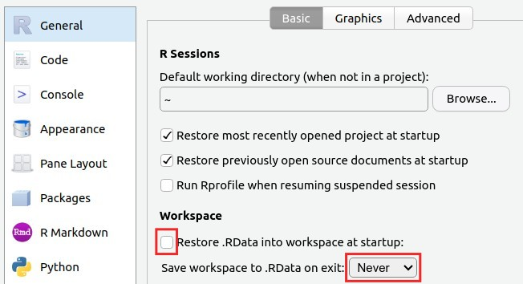
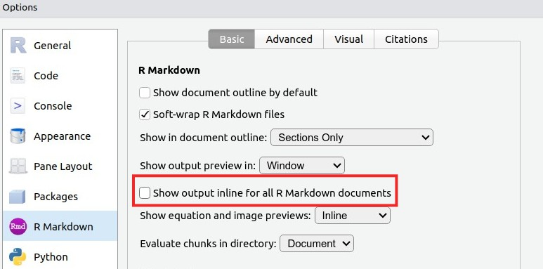

```{r setup, include=FALSE}
knitr::opts_chunk$set(echo = TRUE, warning = FALSE, message = FALSE, out.width = '100%', fig.retina = 4)
```

```{r, include=F}
output_format <- knitr::opts_knit$get("rmarkdown.pandoc.to")
repo_url <- system("git config --get remote.origin.url", intern = TRUE)
repo_name <- sub(".git$", "", basename(repo_url))
org_name <- basename(dirname(repo_url))
rmd_filename <- tools::file_path_sans_ext(basename(knitr::current_input()))
github_pages_url <- paste0("https://", org_name, ".github.io/", repo_name, "/", rmd_filename, ".html")
```

```{r, results='asis', echo=F}
if (grepl('gfm', output_format)) {
  cat('Versión HTML (quizá más legible), [aquí](', github_pages_url, ')\n', sep = '')
} else if (output_format == 'latex') {
  cat('Versión HTML (quizá más legible), [aquí](', github_pages_url, ')\n', sep = '')
}
url_pa02 <- ifelse(
  grepl('geomorfologia', repo_url),
  'https://github.com/geomorfologia-master/mapa-geomorfologico-rd-y-elevaciones',
  'https://github.com/biogeografia-master/dos-muestras-independientes-biometria')
semestre <- '202402'
github_raiz <- 'https://github.com/'
organizacion <- ifelse(
  grepl('geomorfologia', repo_url),
  paste0(github_raiz, 'geomorfologia', '-', semestre),
  paste0(github_raiz, 'biogeografia', '-', semestre))
```

> "Hola Mundo ... sin embargo, el mundo nunca contesta. Dado que el mundo no contesta, mejor pongámonos manos a la obra con análisis, que sí responden."

"Hola Mundo" es el programa más simple y básico que se escribe al aprender un nuevo lenguaje de programación, utilizado para mostrar un mensaje de texto simple en pantalla y verificar que el entorno de desarrollo está configurado correctamente.

# Fecha/hora de entrega

**6 de septiembre de 2024, 11:59 pm.**

# Objetivos de aprendizaje

- Saludar al mundo.

- Aprender los tipos de objetos básicos en R.

- Aprender los elementos básicos de la IDE RStudio (Desktop o en mi servidor).

- Crear una cuenta y tóken de escritura en GitHub.

- Aceptar una asignación de GitHub Classroom.

- Configurar el ambiente en RStudio para garantizar reproducibilidad.

- Realizar tu primer análisis reproducible.

- Aprender lo básico del lenguaje de tipado Markdown.

- Crear tu primer cuaderno reproducible RMarkdown generando una salida en formato PDF.

- Realizar tu primer *commit*>*push*.

# Resultados Esperados

- Comprendes los tipos de objetos básicos en R y su aplicación en un análisis geomorfológico.

- Manejas los elementos principales de la interfaz de RStudio para ejecutar código y visualizar resultados.

- Configuras tu ambiente de trabajo en RStudio para asegurar la reproducibilidad de tus análisis.

- Desarrollas y documentas un análisis reproducible utilizando un cuaderno RMarkdown y lo exportas en formato PDF.

- Aplicas la prueba de hipótesis de dos muestras pareadas, interpretando correctamente los resultados estadísticos obtenidos.

- Utilizas herramientas de control de versiones en GitHub para gestionar tu trabajo de forma eficaz.

- Generas gráficos y tablas en R que presentan los datos de manera clara y comprensible, integrándolos en tu análisis.

# Mandato

Realiza, en el cuaderno RMarkdown `mi-primer-manuscrito.Rmd` de tu propio repo clonado, el ejercicio de inferencia a partir de dos muestras apareadas de la [práctica de aula 2 (PA02)](`r url_pa02`) usando las funciones de R al efecto, siguiendo un guión de manuscrito científico reproducible, que incluye lo siguiente (deberás rellenar en el archivo `mi-primer-manuscrito.Rmd` y también "tejerlo"):

> En el archivo `mi-primer-manuscrito.Rmd`, coloqué mayúsculas allí donde debes rellenar contenido.

- "Hola Mundo". Un bloque de código con las distintas formas de saludar al mundo en R.

- Introducción. Un párrafo.

- Materiales y métodos. Un párrafo.

- Resultados. Un párrafo.

- Discusión. Un párrafo.

- Requisitos adicionales que debes cumplir:

  - ORCID insertado.

  - Al menos 3 referencias bibliográficas usando el estándar Bibtex, que tendrás que citar en el documento allí donde lo consideres oportuno, y que deberán aparecer en la lista de referencias.

  - Al menos un diagrama de caja generado por ti con código de R reproducible. El código fuente debe quedar oculto en el PDF de salida.
  
  - Al menos una figura de archivo (e.g. un único archivo, sólo uno, que muestre, aunque sea parcialmente, lo que entregaste en la práctica 02. si no tienes dicho archivo, puedes usar cualquier otro archivo alegórico al tema o a la práctica).
  
  - Al menos una tabla generada manualmente en Markdown. Por ejemplo, genera una tabla con los resultados de la prueba t de student. Existen herramientas en línea para hacerlo; de hecho, el propio foro de la asignatura también es capaz de convertir tablas desde Excel a Markdown, basta con copiar desde la hoja de cálculo y pegar en la caja de mensajes del foro.
  
  - Al menos una tabla estilizada generada por ti usando código de R reproducible, comando `knitr::kable`. El código fuente debe quedar oculto en el PDF de salida.

# Entregable

Tu repositorio de GitHub, subido a la organización `r organizacion`, conteniendo tanto el cuaderno RMarkdown reproducible editado por ti (`mi-primer-manuscrito.Rmd`), así como el archivo `mi-primer-manuscrito.pdf` que generarás "tejiendo" el referido cuaderno (más explicación en el vídeo tutorial).

# Procedimiento sugerido

Sigue los siguientes pasos recomendados:

1. Realiza el tutorial interactivo ["Introducción a R"](https://geofis.shinyapps.io/tutorial1/). Este tutorial te introducirá al uso de los distintos tipos de objetos en R, y te ayudará a conocer y practicar la sintaxis básica. No evaluaré tu desempeño respecto de dicho tutorial, **pero te recomiendo *muy pero que muy pero que muy encarecidamente* que lo realices de forma interactiva, y que comprendas su contenido tanto como puedas**. La página número 3 del tutorial, "Observaciones y 'truquitos'" es importante; aprende a teclear los carácteres especiales en programación. Si la modalidad del tutorial no te gusta, entonces recurre a cualquiera de estas opciones:

  - Busca vídeos tutoriales que resulten más atractivos.
  - Usa inteligencia artificial para que te enseñe y que, al mismo tiempo, te evalúe.
  - Lo que te funcione mejor, así de simple.

2. Reproduce el [vídeo tutorial "PD01. Hola Mundo"]().

3. Inicia sesión en GitHub si aún no lo has hecho. Verifica que eres miembro/a de la organización, primero entrando en ella visitando esta URL: `r organizacion`. Al entrar, puedes verificar tu membresía en la sección `People`; si eres miembro/a, verás tu nombre de usuario listado allí. También puedes verlo en tu perfil de cuenta de GitHub, haciendo clic en tu avatar (en la página de GitHub, derecha superior), ve a `Your organizations` y deberías ver el nombre de la organización allí. Si verificas que no eres miembro/a, pídeme que te envíe una invitación.

4. Crea un tóken de escritura en GitHub. Haz clic en tu avatar de GitHub (esquina superior derecha en github.com), selecciona `Settings` en el menú. En la página `Settings`, ve a la barra lateral izquierda, clic en la opción `Developer settings`, clic en `Personal access tokens` y después en `Token (classic)`. En la página `Personal access tokens (classic)` presiona `Generate new token`>`Generate new token (classic)`. Te pedirá password o código de verificación. Pon algún texto en la caja `Note` (por ejemplo, "asignaciones"), elige una fecha de vencimiento (preferible el final del semestre) y, en `Scopes`, marca todas las casillas de `repo` y de `admin:repo_hook`, para finalmente presionar el botón verde (abajo del todo) `Generate token`.



5. Acepta la asignación de GitHub Classroom de esta "PD01. Hola Mundo" (PD01). Se creará un repositorio personalizado en la organización.

6. Confirma que se creó tu repositorio personalizado en la organización `r organizacion`.

7. Clona tu repositorio personalizado en el servidor RStudio. Para esto, deberás acceder con tus credenciales, las cuales te envié recientemente. Si no las has encuentra, revisa tu buzón de correo no deseado. Si tampoco está allí, entonces escríbeme para enviártelas.

8. Realiza dos configuraciones importantes en RStudio:

  - **PRIMERO**. Cuando accedas a tu cuenta en el servidor RStudio, configura lo siguiente:
  
    - Menú Tools>Global Options>R General>Workspace, **desmarca** `Restore .RData into workspace at startup:`, y en la opción `Save workspace to .RData on exit:` **elige** `Never`.
    - Presiona `OK`.
  
      
      
    - "Yo podría hacerlo por ti, pero preferí que lo hicieras tú, dado que para garantizar la reproducibilidad de análisis, este paso es importante". Firmado: tu administrador del servidor de programación.

  - **SEGUNDO**. Por varias razones, es preferible que el código de un cuaderno RMarkdown se ejecute en la consola. Para que esto se logre en cada cuaderno nuevo RMarkdown, configura RStudio de la siguiente manera.

    - Ve al menú `Tools>Global Options`.
    
    - En el diálogo, ve a la pestaña `RMarkdown` (color morado).
    
    - **Desmarca** la opción `Show output inline for all RMarkdown documents`.
    
    
    
    - Presiona `OK`.

9. Rellena las partes correspondientes en `mi-primer-manuscrito.Rmd`, siguiendo el mandato y el vídeo tutorial.

10. Teje para generar tu `mi-primer-manuscrito.pdf`. Hazlo periódicamente, no lo dejes para al final.

11. Identifícate para git (`git config ...`).

12. Haz *commit*>*push*.

13. Confirma que tus cambios se subieron a tu repositorio en GitHub.

# Software, hardware y servicios (imprescindibles para esta práctica)

- Navegador (desactiva el traductor para la página del servidor RStudio).

- PC.

- Cuenta en mi servidor RStudio (esta ya te la creé yo).

- Cuenta en GitHub.

- Tóken de escritura en GitHub (explicado en el tutorial).

- Cuenta en OpenAI/ChatGPT, u otros servicios de IA, como Gemini, Claude, etc.

- Código ORCID.

# Software y servicios recomendados para el futuro

> No los necesitarás para desarrollar esta práctica, pero sí para las venideras.

- QGIS Desktop (software).

- GRASS GIS Desktop.

- Cuenta en Google Earth Engine.

# Software y servicios útiles, todos OPCIONALES

## Software en tu propia PC

> Todas estas aplicaciones están disponibles por medio de interfaz de línea de comandos (CLI, "consola", "terminal") en mi servidor. Sólo instala estas aplicaciones si quieres aprender más o tener independencia en tu propia PC.

- R+RStudio Desktop. Si quieres ejecutar código de R en tu PC.

- Python3 | Anaconda | Jupyter Hub | Jupyter Notebook | JupyterLab | Spyder | VS Code. Si quieres ejecutar código de Python en tu PC.

- Git.

- LaTeX en tu PC. Procesador de texto, pensado sobre todo para artículos científicos.

- Docker, para manejar o crear software contenerizado.

- Zotero Desktop.

## Cuentas en los siguientes servicios

- Docker.

- Overleaf.

- Zotero Online.

## Enlaces útiles

- [Tutorial interactivo "Introducción a R"](https://geofis.shinyapps.io/tutorial1/)


- [Vídeo tutorial de esta práctica (PD01)]().